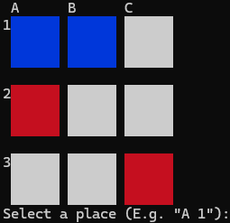

# NACBOT (Noughts And Crosses Bot)
This entire project is within a single C file, `main.c`.

## To build
```
mkdir build
cd build
cmake .. -G "Visual Studio 17 2022" -A x64
cmake --build . --config Release
```

## Screenshots


